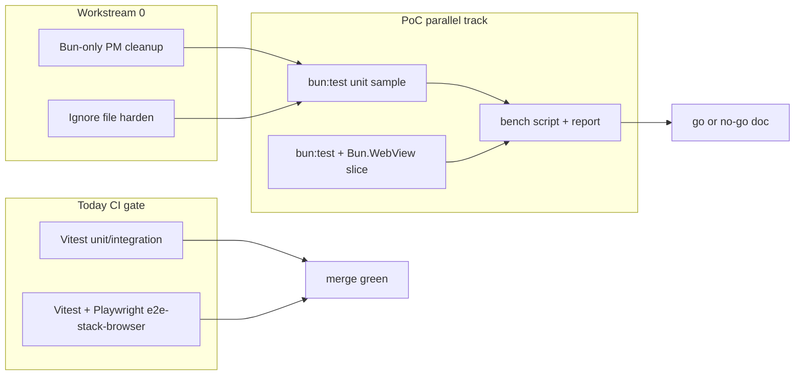

---
todos:
  - id: pm-cleanup
    content: "Bun-only package-manager cleanup: remove yarn/npm/pnpm lockfile remnants, harden .gitignore/.dockerignore, migrate .railway to bun, scrub docs/CI yarn/pnpm fallbacks"
    status: pending
  - id: harness-isolation
    content: "Add apps/web/bun-test harness, bunfig, WebView guard (ephemeral + spawn isolation + CDP exceptions), Make targets; artifact paths under var/bun-test-poc and tmp/bun-test-poc"
    status: pending
  - id: unit-slice
    content: "Port 2–3 unit tests to bun:test; wire scripts/bench-bun-test-poc.sh for median wall-time vs Vitest"
    status: pending
  - id: webview-slice
    content: "Port 2–3 stack-browser flows to Bun.WebView with process-per-file runner and page-exception parity to newGuardedPage"
    status: pending
  - id: bench-docs
    content: "Document performance/time/stability results and go/no-go criteria in docs/bun-test-webview-poc.md; link from TESTING.md"
    status: pending
  - id: ci-optional
    content: "Add non-blocking bun-test-poc CI job with failure artifact upload; keep Vitest/e2e-stack as merge gates"
    status: pending
---

# Issue #37 — bun:test + Bun.WebView PoC (+ Bun-only PM cleanup)

## Context

[Issue #37](https://github.com/Octanest-Git/Octanest/issues/37) asks for a **PoC** of custom test runners on **`bun:test`**, using **`Bun.WebView` where browser automation is needed**, aimed at better CI **performance** and **stability**, with **proper isolation**.

**Additional scope (this revision):** treat Bun as the **only** JS package manager for Octanest tooling — finish the yarn→bun migration surface (docs/CI leftovers, competing lockfiles, ignore hygiene) and migrate the isolated `.railway` IaC install off `npm ci`.

### Current package-manager reality

The monorepo is **already Bun-primary**:

- Root [`package.json`](package.json) pins `"packageManager": "bun@1.4.0"`
- Canonical lockfile is [`bun.lock`](bun.lock) (no root `yarn.lock` / `package-lock.json` / `pnpm-lock.yaml` today)
- CI uses `oven-sh/setup-bun` + `bun install --frozen-lockfile`

Leftovers that still imply a multi-PM world:

- [`.github/workflows/ci.yml`](.github/workflows/ci.yml) header still documents a **pnpm+Corepack fallback**
- [docs/GETTING-STARTED.md](docs/GETTING-STARTED.md) says “Enable Corepack or install Bun”
- [`.railway/`](.railway/) is an isolated npm island (`package-lock.json`, `.npmrc`, docs say `npm ci`) — keep it **isolated from workspaces**, but switch install to **`bun install --frozen-lockfile`** and commit `bun.lock` there
- Root [`.gitignore`](.gitignore) does **not** yet reject accidental `yarn.lock` / `package-lock.json` / `.yarn/` / yarn/pnpm debug logs, or PoC browser artifact paths

**Keep as-is (not yarn leftovers):** product registry docs mentioning “npm / yarn / pnpm” as **client tools** against Octanest’s `/npm/{owner}/` registry ([docs/API.md](docs/API.md)); stack-preset templates under `crates/octanest-api/assets/stack-presets/` that scaffold third-party apps.

Today’s JS test stack ([docs/TESTING.md](docs/TESTING.md), [apps/web/vitest.config.ts](apps/web/vitest.config.ts)):

| Suite | Runner | Isolation today |
|-------|--------|-----------------|
| unit (~23 files) | Vitest `node` | shared process OK |
| integration (~45 files) | Vitest `happy-dom` | `fileParallelism: false` (DOM bleed) |
| e2e-stack | Vitest `node` | shared SQLite DB under `var/e2e/` |
| e2e-stack-browser (~9 files) | Vitest + Playwright Chromium | `fileParallelism: false`; `newGuardedPage` fails on `pageerror` / Octane DOM races |

`Bun.WebView` exists on pinned **Bun 1.4.0** (`backend: "chrome"` on Linux CI). It is **experimental**. Chrome backend spawns **one Chrome per Bun process**; `dataStore.directory` is **process-wide**, not per-view.

**Out of scope for this PoC:** replacing Vitest as the merge gate; porting full happy-dom/Octane Testing Library; Octanest Actions product runners (`docker/octanest-runner`).

## Approach (locked)

1. **Workstream 0 first:** Bun-only package-manager cleanup + ignore-file hardening (unblocks clean CI and avoids reintroducing yarn/npm lockfiles).
2. **Additive test harness** under `apps/web/` + Make/scripts — Vitest remains the default CI gate.
3. **Port a thin vertical slice** of stack-browser flows plus a small unit sample for apples-to-apples metrics.
4. **Optional non-blocking CI job** publishes timings; merge still requires existing Vitest/e2e jobs until a documented go/no-go.
5. **Artifacts only under gitignored `var/` / `tmp/`**; commit the benchmark report + harness code, never profiles/screenshots/raw dumps.



## Workstreams

### 0. Bun-only package-manager cleanup + ignore hygiene

Do this **before** the test PoC so install/CI instructions and lockfile policy are unambiguous.

**Delete / stop tracking competing PM artifacts (if present locally or historically):**

- Never commit root `yarn.lock`, `package-lock.json`, `pnpm-lock.yaml`, `.yarn/`, `.pnp.*`
- Remove any stray yarn/pnpm config at repo root (none expected today)

**Harden [`.gitignore`](.gitignore)** (and [`.dockerignore`](.dockerignore) if present) to reject:

```gitignore
# Competing JS package managers — Bun is the only monorepo PM
yarn.lock
package-lock.json
pnpm-lock.yaml
.yarn/
.pnp.*
yarn-debug.log*
yarn-error.log*
pnpm-debug.log*
npm-debug.log*
```

Also add PoC / browser scratch patterns if they can escape `var/`:

```gitignore
**/.bun-webview/
**/chrome-user-data/
```

(`var/` and `tmp/*` already cover primary artifact roots.)

**Migrate [`.railway/`](.railway/) off npm → bun (still isolated from workspaces):**

- Replace `npm ci` in [docs/DEPLOYMENT.md](docs/DEPLOYMENT.md), [`.railway/README.md`](.railway/README.md), and any Make/`scripts/railway-*` callers with `bun install --frozen-lockfile`
- Generate and commit `.railway/bun.lock`; remove `.railway/package-lock.json` and drop `.railway/.npmrc` if only needed for npm
- Keep the directory **outside** the Turborepo/Bun workspace graph (no accidental hoist into root `node_modules`)

**Docs / CI scrub (active docs only — not archived `.planning/` milestones):**

- [docs/GETTING-STARTED.md](docs/GETTING-STARTED.md): Bun install only; drop “Enable Corepack” as the primary path (optional note: Corepack can satisfy `packageManager` but official `bun` binary is preferred)
- [`.github/workflows/ci.yml`](.github/workflows/ci.yml): remove pnpm fallback comment; Bun is required
- [AGENTS.md](AGENTS.md) / [CONTRIBUTING.md](CONTRIBUTING.md): confirm Bun-only install wording

**Explicit non-goals for this workstream:** changing how end-users talk to the forge npm registry; rewriting stack-preset scaffolds to Bun-only.

### 1. Harness layout and isolation contract

Add a dedicated PoC tree:

- [`apps/web/bun-test/`](apps/web/bun-test/) — `bunfig.toml` (preload only for PoC paths), helpers, sample tests
- [`apps/web/bun-test/lib/webview-guard.ts`](apps/web/bun-test/lib/webview-guard.ts) — `Bun.WebView` wrapper mirroring [`dom-race-guard.ts`](apps/web/e2e/stack-browser/dom-race-guard.ts)
- [`scripts/bench-bun-test-poc.sh`](scripts/bench-bun-test-poc.sh) — timed Vitest vs bun:test runs, writes JSON under `var/bun-test-poc/`
- Make targets: `test-bun-poc`, `bench-bun-poc` (do not wire into `make test` yet)

**Isolation rules (must encode in helpers + docs):**

1. **Always** `dataStore: "ephemeral"` for tests; never write Chrome `--user-data-dir` into the repo.
2. Chrome spawn mode: `backend: { type: "chrome", url: false }` so CI never attaches to a developer Chrome via stale `DevToolsActivePort`.
3. **One browser suite file per Bun process** for WebView tests (Chrome singleton + process-wide profile). Prefer `bun test --parallel` only for pure unit samples; browser files run via a small runner that `spawn`s per file (or sequential `bun test <file>`).
4. `await using` / explicit `close()` so tabs cannot leak across tests; assert no page exceptions before dispose.
5. Page-error parity: enable CDP `Runtime` and collect `exceptionThrown` (WebView has no Playwright `pageerror`); reuse `DOM_RACE_RE` from [`apps/web/src/test/dom-errors.ts`](apps/web/src/test/dom-errors.ts).
6. Stack e2e still uses [`scripts/dev-auth/run-stack-e2e.sh`](scripts/dev-auth/run-stack-e2e.sh) for API/Vite/stubs; PoC browser tests consume the same `OCTANEST_E2E_*` env. Do not share mutable cookies/storage across cases — new view per case.
7. Screenshots / CDP dumps / Chrome profiles / bench JSON → **`var/bun-test-poc/`** (covered by `var/` in `.gitignore`). Local scratch → **`tmp/bun-test-poc/`**. Never write under `apps/web/` source trees.
8. **Shared SQLite stays serial-by-design** for the PoC (same as today): one `var/e2e/octanest.db` per harness run. Do not claim process-per-file WebView isolation fixes forge-state cross-talk; document that as a residual. Avoid porting Vitest’s process-global `lastAdminCookie` pattern — prefer fresh login/seed per case or explicit cookie inject without module globals.
9. Prefer `bun test --isolate` (or process-per-file spawn) for browser files; never `--parallel --no-isolate` with WebView. Call `Bun.WebView.closeAll()` in suite teardown as a safety net.
10. **`view.type()` uses InsertText** (no `keydown`/`keyup`). Prefer flows that use `click` + `type` on Octane `onInput` fields; if a flow depends on key chords, use `press()` explicitly and note behavioral skew vs Playwright `fill`/`press`.

### 2. PoC test slice (what to port)

**Unit (no WebView):** 2–3 pure files from `src/**/*.unit.test.ts` rewritten to `bun:test` under `bun-test/unit/`.

**Browser (WebView):** Port **2–3** stack-browser flows:

1. Status / smoke navigation (cheap baseline)
2. One auth UI path (signup or OIDC)
3. One DOM-race sensitive path (mirror SSH toggle or template picker)

Selector strategy: prefer existing `data-testid` / stable CSS; avoid Playwright `getByRole` until a thin role-helper exists via `evaluate`.

Do **not** port happy-dom integration in this PoC.

### 3. Benchmark and stability documentation

Deliverable: **[`docs/bun-test-webview-poc.md`](docs/bun-test-webview-poc.md)** (linked from [docs/TESTING.md](docs/TESTING.md)) with wall time (median of N≥3), CI job time notes (incl. Playwright install savings), flake counts, Chrome process model limits, and Bun experimental caveats.

Raw JSON stays under gitignored `var/bun-test-poc/`; commit filled-in results in the markdown doc after runs.

Go/no-go cutover criteria (document only; no gate swap in this issue unless metrics clearly win): median browser-slice ≤ Vitest+Playwright; Playwright download optional without flake regression; zero isolation cross-talk; API stable on pinned Bun.

### 4. CI wiring (non-blocking)

Add job `bun-test-poc` on `ubuntu-latest`:

- Bun 1.4.0, `bun install --frozen-lockfile`
- Ensure Chrome/Chromium available (apt or Playwright `chrome-headless-shell` via `BUN_CHROME_PATH`)
- Unit PoC always; browser PoC via existing stack bring-up when `E2E_STACK=1` / Make target
- Upload `var/bun-test-poc/` on failure
- Informational until go/no-go

### 5. Source-control hygiene checklist

Before merge:

- Competing lockfiles ignored (workstream 0)
- [tmp/README.md](tmp/README.md) documents `tmp/bun-test-poc/`
- Bench script cleans ephemeral dirs on exit
- No committed screenshots, HAR, user-data-dir, or Chrome profiles

### 6. Docs / AGENTS touch-ups

- [docs/TESTING.md](docs/TESTING.md): “Experimental bun:test PoC” + link to results
- [AGENTS.md](AGENTS.md): `make test-bun-poc` / `make bench-bun-poc`
- Issue #37 / PR body: gains summary + go/no-go + note that monorepo PM is Bun-only

## Implementation order

1. **Workstream 0** — ignore files, `.railway` → bun, docs/CI scrub
2. Isolation helpers + bunfig + Make targets
3. Unit sample + bench script
4. WebView guard + smoke browser test against live stack
5. Port 1–2 race-sensitive flows
6. Bench locally + CI; write results doc
7. Optional non-blocking CI job; PR against issue #37

## Risks

- `Bun.WebView` experimental API churn (shipped Bun ≥ 1.3.12; pin remains 1.4.0)
- Chrome-per-process limits parallelism; macOS default WebKit vs CI Chrome — **force `backend: "chrome"` everywhere** in PoC
- Selector/API gap vs Playwright (`getByRole` / fixtures / traces) — do not rewrite all of [`commands.ts`](apps/web/e2e/stack-browser/commands.ts); thin CSS/`data-testid` helpers only
- `type()` vs keydown skew on forms that listen for keyboard events
- `.railway` bun migration must not pull IaC deps into the monorepo workspace
- Shared e2e SQLite DB + fixed ports still serialize forge mutations and block concurrent stack runs

## Explicit non-goals

- Deleting Vitest / `@vitest/browser-playwright`
- Reviving component Playwright project (**D-QH-03**)
- Changing coverage-weighted gate math
- Forcing forge **registry clients** to use Bun instead of npm/yarn/pnpm
- Rewriting third-party stack presets to Bun-only
- Full Inspector-Protocol custom reporter (overkill for PoC; use default `bun test` output + bench script JSON)
