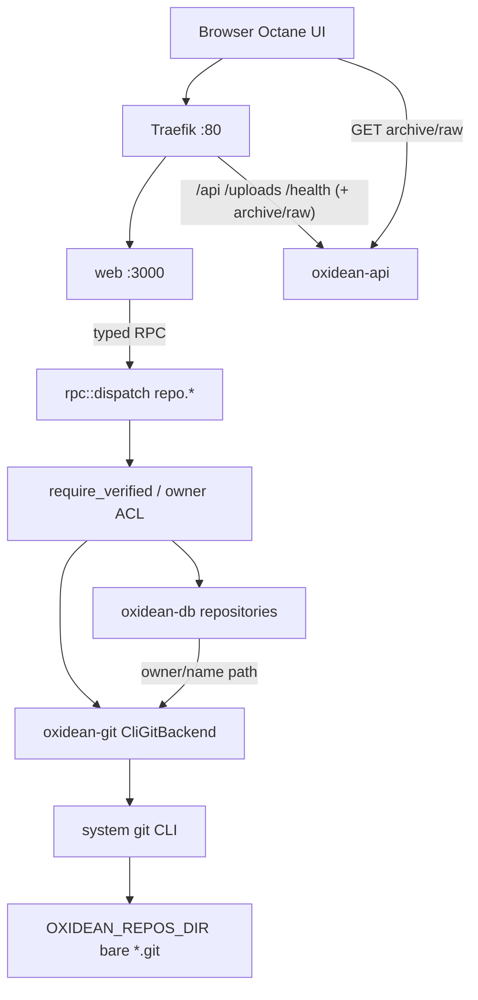

# Phase 7: Git Repos & Browse - Research

**Researched:** 2026-09-12
**Domain:** Filesystem-backed git hosting (bare repos), system `git` CLI backend, forge browse UI (Octane)
**Confidence:** HIGH

<user_constraints>
## User Constraints (from CONTEXT.md)

### Locked Decisions
- **D-01:** Dedicated **`/new`** page; signed-in home “New repository” CTA navigates there
- **D-02:** Create uses **templates**: stack preset + optional License + `.gitignore` as **grouped independent pickers**; include common project files for stacks
- **D-03:** **Wide day-one** stack catalog; **community presets** via **in-repo packs + docs guide** (PRs); public marketplace UI later (designed so packs can feed it)
- **D-04:** **License picker: full SPDX list** (+ none); **`.gitignore`: broad gitignore.io-style catalog**
- **D-05:** **Owner fixed to current user** on `/new` (orgs Phase 10)
- **D-06:** **GitHub-ish** name/slug rules (letters, digits, hyphen, underscore, period; reject reserved names) — **Reversibility:** costly — URL and uniqueness contracts
- **D-07:** Optional **description** on create; shown on repo home
- **D-08:** Default visibility **sys-admin configurable**; if unset → **public**
- **D-09:** Default branch **`main`**; overridable in **account settings** (org settings → Phase 10)
- **D-10:** After create: **empty-state first-push guide** when no commit (forge-familiar); else Code view
- **D-11:** **New repository CTA disabled** until email verified; **`/new` blocked** until verified (redirect/wall) — aligns Phase 5 D-12 + `require_verified` on `repo.create`
- **D-12:** Duplicate name → **inline field error**
- **D-13:** Signed-in **`/` is a dashboard** (Gitea/GitHub feel): **repo list** (recently updated first, visibility badge/lock), **empty hero** when zero repos, **activity feed placeholder** only — **Reversibility:** costly — home IA contract
- **D-14:** Repo URLs **`/{owner}/{repo}`** with **reserved-name denylist** (`login`, `setup`, `new`, `status`, etc.) — **Reversibility:** one-way — public URL scheme
- **D-15:** Default Code view: **file tree + rendered README below** when present; empty repo → first-push guide
- **D-16:** **GitHub-like IA:** Code primary; `/commits/{ref}`; `/branches`; `/tags`; `/commit/{sha}` with diffs; **`/compare/{base}...{head}`**; **`/blame/{ref}/path`**; per-file history from blob
- **D-17:** Paths: `/tree/{ref}/…`, `/blob/{ref}/…`, `/raw/{ref}/…`; refs use **branch/tag names** when possible
- **D-18:** **Safe GFM-like Markdown** rendering (sanitized) for GitHub parity
- **D-19:** **Syntax highlighting** matches **GitHub’s language/file-type coverage**, plus **`.tsrx`** and **`.ripple`**
- **D-20:** Line permalinks `#L10` / `#L10-L20`; large files **GitHub-like soft limits**; binaries: **images inline**, else download / cannot preview
- **D-21:** **Submodules** as entries with **recursive browsing**
- **D-22:** Code tab **clone/download box**: HTTPS URL now (auth Phase 8); SSH placeholder until Phase 9; archives via GIT-07
- **D-23:** **Private = owner-only** until orgs/collaborators — **Reversibility:** costly — ACL model stub
- **D-24:** **Anonymous read** of public repos
- **D-25:** Private / no-access → **404** (anti-enumeration)
- **D-26:** Owner can **toggle public/private** in repo settings in Phase 7
- **D-27:** Branch create/rename/delete: **owner only**
- **D-28:** Soft-protect default branch: **block delete/rename** in UI (full branch protection later)
- **D-29:** Archives: **zip and tar.gz** from Code clone/download menu for current ref (also tags/commits where natural)
- **D-30:** **Bare repos** at `{OXIDEAN_REPOS_DIR}/{owner}/{name}.git` (default `var/repos`) + **Compose volume** — **Reversibility:** costly — storage layout
- **D-31:** **`OXIDEAN_REPOS_DIR`** configurable (mirror uploads pattern)
- **D-32:** **REQUIREMENT AMENDMENT (GIT-09):** Phase 7 implements git ops via **system `git` CLI**, not gitoxide-first. Keep a **`GitBackend` abstraction**; **document future gitoxide** path when it covers needed operations — **Reversibility:** costly — roadmap/requirements wording + crate design
- **D-33:** **Fail boot** if `git` missing or version **&lt; 2.5** — **Reversibility:** one-way — operator contract
- **D-34:** Factory reset: **modal with radio buttons** for reset scope (e.g. DB-only vs DB+repos) — extends Phase 6 danger zone
- **D-35:** Repo delete: **soft-delete in DB**; **async/later disk purge**
- **D-36:** **Periodic orphan reconcile**; sys-admin configures **cleanup frequency**
- **D-37:** **Scheduled `git gc`** + sys-admin **manual GC** trigger
- **D-38:** Repos owned by **API process user**; document Compose UID/GID

### Claude's Discretion
- Exact SPDX packaging / license text sourcing and gitignore.io catalog packaging
- Exact reserved-name denylist contents (must cover all flat app routes)
- Exact factory-reset radio options copy and defaults
- Soft-delete retention window / purge job timing details
- Highlighting engine choice (must meet D-19 coverage including `.tsrx` / `.ripple`)
- Compare/blame/diff UX details within GitHub parity
- `GitBackend` trait shape and how CLI is invoked (researcher/planner)

### Deferred Ideas (OUT OF SCOPE)
- Full home **activity feed** (social + repo + git) — further planning required
- **Org-level** default branch / visibility settings — Phase 10
- **Public marketplace UI** for stack presets — later phase
- HTTPS PAT auth (Phase 8) / SSH (Phase 9) — clone URL may show early
- Full **branch protection** product rules — soft default-branch protect only in Phase 7
- Update `.planning/REQUIREMENTS.md` GIT-09 wording to CLI-primary + gitoxide-later (planner/docs task)
</user_constraints>

<phase_requirements>
## Phase Requirements

| ID | Description | Research Support |
|----|-------------|------------------|
| GIT-01 | User can create a repository (public or private) | Bare init + DB row + `require_verified` + `/new` UI; templates optional initial commit |
| GIT-05 | Browse files, commits, branches, tags in web UI | `GitBackend` read APIs via `ls-tree`/`log`/`show`/`blame`; Octane routes per D-16/D-17 |
| GIT-06 | Create, rename, delete branches from web UI where permitted | Owner-only + soft-protect default; `git branch` / `update-ref` on bare |
| GIT-07 | Download source archive for a ref | `git archive --format=zip\|tar.gz`; HTTP download route (not huge RPC) |
| GIT-08 | Repo objects on local filesystem (volume-backed) | `OXIDEAN_REPOS_DIR` + Compose bind mirroring uploads |
| GIT-09 | *(amended D-32)* Git ops via system `git` CLI; gitoxide later | `CliGitBackend` primary; docs + trait leave gitoxide path |
| GIT-10 | Architecture allows swapping backends | `GitBackend` trait + docs in ARCHITECTURE/CONFIGURATION |
</phase_requirements>

## Summary

Phase 7 adds the first forge surface: create public/private repos, browse GitHub-like history, manage branches (owner-only), and download archives. **CONTEXT overrides older ROADMAP/REQUIREMENTS gitoxide-first wording:** implement a deep `GitBackend` seam with a **system `git` CLI (2.5+) adapter now**, document a future gitoxide adapter, and **fail API boot** if `git` is missing or too old. Repos are **bare** trees under `{OXIDEAN_REPOS_DIR}/{owner}/{name}.git` (default `var/repos`), with DB metadata (visibility, soft-delete, updated_at) and ACL stub **private = owner-only**.

The API Dockerfile currently installs only `ca-certificates` and `curl` — **Compose images will fail D-33 until `git` is installed**. Archives and raw blobs should follow the avatar pattern: thin HTTP GET routes under Traefik `/api` (or dedicated prefixes), not multi‑MB RPC payloads. UI stays Octane `.tsrx` + TanStack Query; Markdown via `remark-gfm` + `rehype-sanitize`; highlighting via **Shiki** with custom TextMate grammars for `.tsrx` / `.ripple`.

**Primary recommendation:** Add `crates/oxidean-git` (`GitBackend` + `CliGitBackend` via `tokio::process::Command` argv arrays), wire `repo.*` RPC + archive/raw HTTP routes, tri-dialect `repositories` migration, Compose `var/repos` volume + Dockerfile `git`, then build `/new` + `/{owner}/{repo}` browse surfaces per UI-SPEC.

## Architectural Responsibility Map

| Capability | Primary Tier | Secondary Tier | Rationale |
|------------|-------------|----------------|-----------|
| Repo create / visibility / soft-delete metadata | API / Backend | Database / Storage | Authz + durable metadata; disk path derived from owner/name |
| Bare git object store | Database / Storage (filesystem) | API / Backend | Volume-backed path; API process owns files (D-38) |
| Git read/write operations | API / Backend | — | `GitBackend` invoked only server-side; never from browser |
| `require_verified` on create | API / Backend | Frontend Server (SSR) | Gate in RPC; UI disables CTA / walls `/new` |
| Browse UI (tree/blob/commits/branches) | Browser / Client | Frontend Server (SSR) | Octane routes; SSR for access redirect / 404 parity |
| Safe Markdown + syntax highlight | Browser / Client | — | Untrusted repo content; sanitize + highlight client-side (or SSR-safe pipeline) |
| Archive / raw downloads | API / Backend | CDN / Static (via Traefik) | Streaming binary responses; Traefik already routes `/api` `/uploads` |
| Factory reset scope (DB vs DB+repos) | API / Backend | Browser / Client | Extend `admin.instance.factory_reset`; modal radios in admin UI |
| Orphan reconcile / scheduled gc | API / Backend | — | Background jobs in API process (or future worker); sys-admin knobs |

## Project Constraints (from .cursor/rules/)

| Rule | Directive |
|------|-----------|
| `oxidean-core.mdc` | One product; Bun + Cargo monorepo; Octane `.tsrx` UI; `make rpc-gen` after RPC changes; dialect branching only in `oxidean-db`; no secrets in commits; extend existing patterns |
| `rust-crates.mdc` | `oxidean-core` pure domain; `oxidean-db` owns SQL; `oxidean-api` calls Database; `Result` + structured errors; preserve `require_verified` / admin / bootstrap; nextest in CI |
| `rpc-codegen.mdc` | Rust procedures authoritative; regenerate api-client; `make rpc-sync-check`; stable error codes for UI |
| `octane-ui.mdc` | `.tsrx` + Rivet; `@if`/`@else` (no `@else if`); `onInput` for text; Query for server state; forms `method="post" action="#"` |

Relevant skills: `octane`, `rust-best-practices`, `rust-async-patterns`, `codebase-design` (deep `GitBackend` module), `tdd` (test at trait + RPC seams).

## Standard Stack

### Core

| Library | Version | Purpose | Why Standard |
|---------|---------|---------|--------------|
| System `git` CLI | **≥ 2.5** (host has **2.55.0**) | All Phase 7 git ops | Locked D-32/D-33; full porcelain/plumbing for browse + archive [VERIFIED: host `git --version`; CITED: git-scm.com/docs/git-init] |
| `tokio` (workspace) | already in workspace | `tokio::process::Command` for non-blocking CLI | Existing async runtime; no new process crate required [VERIFIED: Cargo.toml workspace.dependencies] |
| Axum (existing) | in `oxidean-api` | RPC + archive/raw HTTP routes | Established forge edge [VERIFIED: crates/oxidean-api/src/app.rs] |
| sqlx multi-dialect (existing) | `oxidean-db` | `repositories` (+ settings columns) | Tri-dialect migration parity [VERIFIED: crates/oxidean-db/migrations/] |

### Supporting

| Library | Version | Purpose | When to Use |
|---------|---------|---------|-------------|
| `shiki` | **4.4.3** | Syntax highlighting + custom langs | Blob/blame/README code fences; load TextMate for `.tsrx`/`.ripple` [VERIFIED: npm view; CITED: shiki.style/guide/load-lang] |
| `unified` | **11.0.5** | Markdown pipeline host | README / GFM rendering [VERIFIED: npm view] |
| `remark-parse` | **11.0.0** | MD parse | Pipeline [VERIFIED: npm view] |
| `remark-gfm` | **4.0.1** | GFM tables/strikethrough/task lists | D-18 parity [VERIFIED: npm view] |
| `remark-rehype` | **11.1.2** | MD → HAST | Pipeline [VERIFIED: npm view] |
| `rehype-sanitize` | **6.0.0** | GitHub-style HTML allowlist | XSS on untrusted README [VERIFIED: npm view; CITED: github.com/rehypejs/rehype-sanitize] |
| `rehype-stringify` | **10.0.1** | HAST → HTML | Pipeline [VERIFIED: npm view] |
| `spdx-license-list` | **6.12.0** | Full SPDX IDs + license text | Create picker + LICENSE file content [VERIFIED: npm view; CITED: npmjs.com/package/spdx-license-list] |

### Alternatives Considered

| Instead of | Could Use | Tradeoff |
|------------|-----------|----------|
| CLI `GitBackend` (locked) | gitoxide/`gix` now | Deferred by D-32 until feature parity; keep trait only |
| `rehype-sanitize` | `isomorphic-dompurify` | DOMPurify package flagged **SUS (too-new)** by legitimacy seam — prefer rehype [VERIFIED: package-legitimacy] |
| Shiki | highlight.js / Prism | Weaker custom-lang story vs TextMate; Shiki matches GitHub-class coverage [ASSUMED for hljs gap] |
| Vendored `github/gitignore` templates | Live gitignore.io HTTP API | Offline/deterministic create; no runtime network dependency [ASSUMED packaging choice] |
| New Rust process crate (`duct`, etc.) | `tokio::process::Command` | Extra dep; argv arrays already safe if never shelled [ASSUMED] |

**Installation (frontend supporting only — no new Rust crates required beyond workspace member):**

```bash
# apps/web (or shared package if planner splits markdown helpers)
bun add shiki unified remark-parse remark-gfm remark-rehype rehype-sanitize rehype-stringify spdx-license-list
```

**Version verification (2026-09-12):** `npm view` as tabled above; `git version 2.55.0` on research host; legitimacy gate OK for all recommended npm packages except removed/flagged alternatives.

**Discretion recommendations (locked into research for planner):**
1. **Highlighting:** Shiki + in-repo minimal TextMate grammars for `tsrx` / `ripple` (D-19 — no TS/JS alias gap).
2. **SPDX:** `spdx-license-list/full` for text; picker uses IDs + “None”.
3. **gitignore catalog:** Vendor a curated subset of [github/gitignore](https://github.com/github/gitignore) as static JSON/files under `apps/web` or `crates/oxidean-api` assets — do **not** call gitignore.io at request time.
4. **GitBackend:** Async trait in new crate `oxidean-git`; only `CliGitBackend` shipped; stub module docs for future `GixGitBackend`.

## Package Legitimacy Audit

| Package | Registry | Age | Downloads | Source Repo | Verdict | Disposition |
|---------|----------|-----|-----------|-------------|---------|-------------|
| shiki | npm | years (latest 2026-08-10) | ~17M/wk | github.com/shikijs/shiki | OK | Approved |
| spdx-license-list | npm | years (latest 2026-07-24) | ~376k/wk | github.com/sindresorhus/spdx-license-list | OK | Approved |
| rehype-sanitize | npm | years | ~7.7M/wk | github.com/rehypejs/rehype-sanitize | OK | Approved |
| remark-gfm | npm | years | ~29M/wk | github.com/remarkjs/remark-gfm | OK | Approved |
| remark-parse | npm | years | ~37M/wk | github.com/remarkjs/remark | OK | Approved |
| remark-rehype | npm | years | ~32M/wk | github.com/remarkjs/remark-rehype | OK | Approved |
| rehype-stringify | npm | years | ~6.1M/wk | github.com/rehypejs/rehype | OK | Approved |
| unified | npm | years | ~40M/wk | github.com/unifiedjs/unified | OK | Approved |
| isomorphic-dompurify | npm | flagged too-new | ~4.3M/wk | kkomelin/isomorphic-dompurify | SUS | **REMOVED** — use rehype-sanitize |
| @octokit/gitignore | npm | — | — | — | SLOP | **REMOVED** |

**Packages removed due to [SLOP] verdict:** `@octokit/gitignore`
**Packages flagged as suspicious [SUS]:** `isomorphic-dompurify` (not recommended)

*No new crates.io packages required for CLI backend.*

## Architecture Patterns

### System Architecture Diagram



### Recommended Project Structure

```
crates/
├── oxidean-git/                 # NEW: GitBackend trait + CliGitBackend + version probe
│   ├── src/lib.rs
│   ├── src/backend.rs            # trait + error types
│   ├── src/cli.rs                # argv Command runner (no shell)
│   └── src/version.rs            # parse git --version; enforce >= 2.5
├── oxidean-core/                # repo DTOs, validate_repo_name, reserved route names
├── oxidean-db/migrations/*/0007_repositories.sql
└── oxidean-api/src/
    ├── git/                      # thin wiring: path resolve, ACL helpers
    ├── auth/gate.rs              # reuse require_verified
    ├── rpc.rs                    # repo.* procedures
    └── routes/repo_raw.rs        # archive + raw blob HTTP
apps/web/src/
├── routes/new.tsrx
├── routes/$owner.$repo*.tsrx     # or nested tree/blob/… per TanStack file routing
├── components/repo/              # tree, blob, clone box, branch list
├── lib/markdown.ts               # unified + sanitize
└── lib/highlight.ts              # shiki singleton
docs/
├── ARCHITECTURE.md               # GitBackend + CLI-now / gix-later
└── CONFIGURATION.md              # OXIDEAN_REPOS_DIR, git floor, visibility default
```

### Pattern 1: GitBackend deep module (discretion)

**What:** Small async trait hiding all git invocation; API/RPC never shell out directly.
**When to use:** Every create/browse/branch/archive/gc call.
**Example:**

```rust
// Source: research recommendation (codebase-design deep module); CLI args per git-scm docs
#[async_trait::async_trait]
pub trait GitBackend: Send + Sync {
    async fn init_bare(&self, path: &Path, initial_branch: &str) -> Result<(), GitError>;
    async fn list_refs(&self, repo: &Path) -> Result<Vec<GitRef>, GitError>;
    async fn ls_tree(&self, repo: &Path, treeish: &str, path: &str) -> Result<Vec<TreeEntry>, GitError>;
    async fn cat_blob(&self, repo: &Path, treeish: &str, path: &str) -> Result<Vec<u8>, GitError>;
    async fn log(&self, repo: &Path, refname: &str, skip: u32, limit: u32) -> Result<Vec<CommitSummary>, GitError>;
    async fn show_commit(&self, repo: &Path, sha: &str) -> Result<CommitDetail, GitError>;
    async fn blame(&self, repo: &Path, refname: &str, path: &str) -> Result<BlameFile, GitError>;
    async fn diff(&self, repo: &Path, base: &str, head: &str) -> Result<DiffResult, GitError>;
    async fn branch_create(&self, repo: &Path, name: &str, start: &str) -> Result<(), GitError>;
    async fn branch_rename(&self, repo: &Path, from: &str, to: &str) -> Result<(), GitError>;
    async fn branch_delete(&self, repo: &Path, name: &str) -> Result<(), GitError>;
    async fn archive(&self, repo: &Path, treeish: &str, format: ArchiveFormat) -> Result<Vec<u8>, GitError>;
    async fn gc(&self, repo: &Path) -> Result<(), GitError>;
}
```

### Pattern 2: Bare init + default branch (Git 2.5-compatible)

**What:** Honor D-33 (≥2.5) without requiring `--initial-branch` (Git **2.28+**).
**When to use:** Every `repo.create`.

```bash
# Source: https://git-scm.com/docs/git-init — --bare; symbolic-ref for unborn HEAD
git init --bare /path/to/owner/name.git
git -C /path/to/owner/name.git symbolic-ref HEAD refs/heads/main
```

Optional optimization when version ≥ 2.28: `git init --bare --initial-branch=main …` [CITED: git-scm.com/docs/git-init].

### Pattern 3: Archive streaming HTTP (mirror avatar)

**What:** `GET /api/repos/{owner}/{repo}/archive/{ref}.{zip|tar.gz}` after ACL check; spawn `git archive` and stream stdout.
**When to use:** GIT-07 / D-29.

```bash
# Source: https://git-scm.com/docs/git-archive
git -C /path/repo.git archive --format=zip --prefix=name/ main
git -C /path/repo.git archive --format=tar.gz --prefix=name/ main
```

Empty repos (no commits): archive **fails** — UI must hide/disable download until history exists [VERIFIED: local probe this session].

### Pattern 4: ACL stub + anti-enumeration

**What:** Resolve repo by owner+name; if missing OR private and caller ≠ owner → identical `notFound` / RPC `repo.not_found` (no `repo.forbidden` leak).
**When to use:** All read paths (D-25).

### Anti-Patterns to Avoid

- **Shelling git via `sh -c`:** Argument injection on ref/path names — always argv arrays.
- **gitoxide-first implementation:** Contradicts D-32; only document future adapter.
- **Putting large blobs/archives in RPC JSON:** Use HTTP routes.
- **Returning “private repository” errors:** Violates D-25.
- **Checking out working trees on the server for browse:** Prefer plumbing/`git show`/`ls-tree` on bare.
- **Mixing React `return (` with Rivet:** Octane rule — breaks HMR.
- **Hand-editing `packages/api-client`:** Must `make rpc-gen`.

## Don't Hand-Roll

| Problem | Don't Build | Use Instead | Why |
|---------|-------------|-------------|-----|
| Git object/protocol ops | Custom pack parsers | System `git` via `GitBackend` | Edge cases, refs, archives already solved |
| SPDX license corpus | Manual copy of licenses | `spdx-license-list` | Canonical IDs + text [CITED: npm] |
| GFM + XSS sanitize | Custom HTML allowlist | `remark-gfm` + `rehype-sanitize` | GitHub-style schema maintained upstream |
| Syntax highlighting | Regex highlighters | Shiki + TextMate | Coverage + custom langs [CITED: shiki.style] |
| Process supervision | Custom wait loops | `tokio::process` | Cancellation + async integration |
| Avatar-style FS path safety | Ad-hoc joins | Same canonicalize/basename guards as `avatar.rs` | Path traversal already solved [VERIFIED: crates/oxidean-api/src/routes/avatar.rs] |

**Key insight:** The hard forge problems (compat, archive formats, blame, rename) are already in `git`; the product risk is ACL, path layout, UI IA, and keeping a swappable seam — not reimplementing Git.

## Common Pitfalls

### Pitfall 1: API image lacks `git`
**What goes wrong:** Compose boot exits (D-33) or runtime “command not found”.
**Why it happens:** `crates/oxidean-api/Dockerfile` installs only `ca-certificates` `curl` [VERIFIED: crates/oxidean-api/Dockerfile:7-10].
**How to avoid:** `apt-get install -y git` in runtime image; CI/smoke assert `git --version`.
**Warning signs:** Healthy `/health` but every `repo.*` fails; boot exit in logs.

### Pitfall 2: Assuming `--initial-branch` on Git 2.5
**What goes wrong:** Create fails on older distros that still meet D-33.
**Why it happens:** `--initial-branch` landed in **2.28**, not 2.5 [CITED: git-scm.com/docs/git-init history / community docs].
**How to avoid:** Prefer `symbolic-ref HEAD refs/heads/<branch>` after `init --bare`.
**Warning signs:** `unknown option 'initial-branch'`.

### Pitfall 3: Reserved route `new` missing from denylist
**What goes wrong:** User `new` steals `/new` or collides with create route.
**Why it happens:** Current `RESERVED_USERNAMES` lacks `"new"` [VERIFIED: crates/oxidean-core/src/auth_types.rs:200-234 — list ends with `"setup"`, `"system-administrator"`; no `"new"`].
**How to avoid:** Extend reserved list with all flat routes from UI-SPEC (`new`, and any new top-level paths).
**Warning signs:** `/new` renders a user profile/repo instead of create.

### Pitfall 4: Repo name rules ≠ username rules
**What goes wrong:** Reject valid GitHub-ish names with `_` or `.`.
**Why it happens:** `validate_username` allows only alphanumeric + hyphen [VERIFIED: crates/oxidean-core/src/auth_types.rs:242-254]; D-06 allows underscore and period for **repo** names.
**How to avoid:** Separate `validate_repo_name` (do not reuse username validator).
**Warning signs:** Create form rejects `my_app` / `lib.rs`-style names incorrectly.

### Pitfall 5: Relative `var/repos` vs Compose absolute mount
**What goes wrong:** Repos written outside the volume.
**Why it happens:** Uploads use default `var/uploads` with CWD `/` → `/var/uploads` matching bind `./var/uploads:/var/uploads` [VERIFIED: app.rs:47; docker-compose.yml:52-53]. Same pattern must be used for repos (`var/repos` → `/var/repos`).
**How to avoid:** Document `OXIDEAN_REPOS_DIR` default `var/repos`; Compose bind `./var/repos:/var/repos`; optional explicit env.
**Warning signs:** Host `./var/repos` empty while container has data under another path.

### Pitfall 6: Archive / blame on empty repository
**What goes wrong:** 500s from git CLI.
**Why it happens:** No commits ⇒ no tree for `archive`/`ls-tree`.
**How to avoid:** Detect empty (no refs/heads tip); return structured empty-state; disable downloads.
**Warning signs:** Clone box archive items error immediately after create without templates.

### Pitfall 7: Factory reset ignores disk
**What goes wrong:** After DB wipe, orphan bare repos remain (or vice versa).
**Why it happens:** Current `factory_reset_instance` only deletes DB tables [VERIFIED: crates/oxidean-db/src/lib.rs:370-404].
**How to avoid:** D-34 scope radios; implement disk wipe path when “Database and repositories” selected; orphan reconcile (D-36) for leftover dirs.
**Warning signs:** Re-create same name hits leftover `.git` on disk.

### Pitfall 8: Private repo information leak
**What goes wrong:** Distinct status codes/messages reveal existence.
**How to avoid:** Unified not-found for missing and unauthorized private (D-25).
**Warning signs:** 403 vs 404 differences in network tab.

## Code Examples

### Boot: require git ≥ 2.5

```rust
// Source: D-33; parse output of `git --version` (host verified: "git version 2.55.0")
fn assert_git_version(min: (u32, u32, u32)) -> Result<(), String> {
    let out = std::process::Command::new("git")
        .arg("--version")
        .output()
        .map_err(|e| format!("git missing: {e}"))?;
    if !out.status.success() {
        return Err("git --version failed".into());
    }
    let s = String::from_utf8_lossy(&out.stdout);
    // expect: "git version X.Y.Z..."
    let ver = parse_git_version(&s)?; // implement semver-ish major.minor.patch
    if ver < min {
        return Err(format!("git {ver:?} < required {min:?}"));
    }
    Ok(())
}
// main: if let Err(e) = assert_git_version((2, 5, 0)) { eprintln!("{e}"); std::process::exit(1); }
```

### Safe CLI invocation (no shell)

```rust
// Source: tokio::process pattern; never pass user strings through `sh -c`
use tokio::process::Command;
let output = Command::new("git")
    .arg("-C")
    .arg(repo_path)
    .arg("ls-tree")
    .arg("-l")
    .arg("--full-tree")
    .arg(treeish) // validated ref
    .arg(path)    // validated relative path
    .output()
    .await?;
```

### Safe GFM render

```ts
// Source: https://github.com/rehypejs/rehype-sanitize + remark-gfm
import { unified } from "unified";
import remarkParse from "remark-parse";
import remarkGfm from "remark-gfm";
import remarkRehype from "remark-rehype";
import rehypeSanitize from "rehype-sanitize";
import rehypeStringify from "rehype-stringify";

export async function renderGfm(markdown: string): Promise<string> {
  const file = await unified()
    .use(remarkParse)
    .use(remarkGfm)
    .use(remarkRehype)
    .use(rehypeSanitize) // after last unsafe transform
    .use(rehypeStringify)
    .process(markdown);
  return String(file);
}
```

### Shiki custom language

```ts
// Source: https://shiki.style/guide/load-lang
import { createHighlighter } from "shiki";
import tsrxGrammar from "./grammars/tsrx.tmLanguage.json";

const highlighter = await createHighlighter({
  langs: [{ name: "tsrx", scopeName: "source.tsrx", ...tsrxGrammar }],
  themes: ["github-light", "github-dark"],
});
```

### Browse tree entry modes

```text
# Source: https://git-scm.com/docs/git-ls-tree — objectmode/objecttype
# 100644 blob … file
# 040000 tree … directory
# 160000 commit … gitlink/submodule (D-21)
```

## State of the Art

| Old Approach | Current Approach | When Changed | Impact |
|--------------|------------------|--------------|--------|
| ROADMAP/REQUIREMENTS: gitoxide-first (GIT-09) | CONTEXT D-32: CLI-first + gitoxide later | 2026-09-12 discuss | Planner amends GIT-09 wording; crate trait still satisfies GIT-10 |
| Default branch `master` | `main` via symbolic-ref / init.defaultBranch | Git community + Oxidean D-09 | Empty HEAD points at `refs/heads/main` |
| Shelling out ad hoc in handlers | Deep `GitBackend` module | Phase 7 | Testability + future gix swap |

**Deprecated/outdated:**
- Treating GIT-09 gitoxide text as Phase 7 implementation truth — **CONTEXT wins**.
- Relying on `--initial-branch` as the only way to set `main` under a 2.5 floor.

## Assumptions Log

| # | Claim | Section | Risk if Wrong |
|---|-------|---------|---------------|
| A1 | Vendoring `github/gitignore` subset is preferred over live gitignore.io API | Standard Stack | Need network/API key design if user wanted live catalog |
| A2 | In-repo minimal TextMate grammars for `.tsrx`/`.ripple` are required for D-19 (no TS-alias gap escape) | Discretion / Shiki | Extra grammar authoring effort if TextMate scope mapping is fiddly |
| A3 | Background orphan purge + gc can live in-process with simple interval first | D-36/D-37 | May need separate worker if load grows |
| A4 | Soft-delete retention ~7–30 days is acceptable default until user sets policy | D-35 discretion | Disk pressure if too long |
| A5 | `async-trait` (or RPITIT) acceptable for `GitBackend` | Pattern 1 | Edition/MSRV clippy prefs |
| A6 | highlight.js would not meet D-19 custom-lang bar as cleanly as Shiki | Alternatives | If team forbids WASM/Shiki, need alternate plan |

**If this table is empty:** N/A — assumptions listed above need confirmation only where marked discretion.

## Open Questions (RESOLVED)

1. **Exact soft-delete retention / purge cadence** — RESOLVED
   - What we know: D-35/D-36 require soft-delete + periodic orphan reconcile; details are discretion.
   - What's unclear: Default days and whether sys-admin UI lands in Phase 7 or settings stub.
   - Recommendation: Default 14-day purge job + sys-admin frequency in instance settings; document in CONFIGURATION.
   - **Resolution:** Adopt recommendation — default **14-day** soft-delete retention + orphan reconcile job; sys-admin configures cleanup frequency in instance settings / CONFIGURATION (plans 07-09/07-10, A4).

2. **Initial commit for templates** — RESOLVED
   - What we know: D-02 wants stack/license/gitignore files; empty repos show first-push guide (D-10).
   - What's unclear: Always create initial commit vs leave empty when all pickers are None.
   - Recommendation: If any template content selected → single initial commit on default branch via temp worktree or plumbing; if all None → bare empty + first-push guide.
   - **Resolution:** Adopt recommendation — any selected template content → single initial commit on default branch; all None → bare empty + Quick setup (plan 07-03 ASSUME Q2).

3. **TanStack file-route shape for `/{owner}/{repo}/…`** — RESOLVED
   - What we know: Flat reserved routes exist; no `$owner` routes yet [VERIFIED: apps/web/src/routes/ listing].
   - What's unclear: Single splat vs many explicit routes.
   - Recommendation: Explicit routes matching UI-SPEC paths for clarity and SSR loaders.
   - **Resolution:** Adopt recommendation — explicit Octane/`$owner.$repo.*` routes matching UI-SPEC paths (D-14/D-16/D-17); no catch-all splat for browse IA.

4. **Compare/blame depth in Phase 7** — RESOLVED
   - What we know: D-16 includes compare + blame; discretion on UX details.
   - What's unclear: Pagination limits, binary blame behavior.
   - Recommendation: Ship functional unified diff + blame with soft file-size caps (D-20).
   - **Resolution:** Adopt recommendation — functional unified diff + blame with soft caps / Load more (plan 07-06 ASSUME Q4); binary blame follows D-20 cannot-preview path.

## Environment Availability

| Dependency | Required By | Available | Version | Fallback |
|------------|------------|-----------|---------|----------|
| `git` CLI | All git ops / D-33 | ✓ (host) | 2.55.0 | None — fail boot; **must install in API Docker image** |
| `node` / `bun` | Web packages | ✓ | bun 1.4.0 / node present | — |
| `cargo` | New crate | ✓ | 1.100.0-nightly | — |
| Docker / Compose | Volume + image git | Assumed for ops | — | Document host `make` needs local git |
| Context7 MCP | Docs lookup | ✗ | — | Official git-scm WebFetch + npm view used |

**Missing dependencies with no fallback:**
- `git` inside `oxidean-api` runtime image (blocking for Compose) — planner Wave 0 must add package install.

**Missing dependencies with fallback:**
- Context7 — used official docs via WebFetch/WebSearch.

Step 2.6 note: Host research environment has git 2.55.0; production path is Compose image.

## Validation Architecture

### Test Framework

| Property | Value |
|----------|-------|
| Framework | Rust: cargo nextest (CI profile) + `cargo test`; Web: Vitest 5 (unit / integration / e2e projects) |
| Config file | `apps/web/vitest.config.ts`; Makefile `make test` |
| Quick run command | `cargo nextest run -p oxidean-git --lib` (after crate exists) && `cd apps/web && bun run test:unit` |
| Full suite command | `make test` |

### Phase Requirements → Test Map

| Req ID | Behavior | Test Type | Automated Command | File Exists? |
|--------|----------|-----------|-------------------|-------------|
| GIT-01 | Verified user creates public/private repo; unverified → `auth.email_unverified` | integration | `cargo nextest run -p oxidean-api -- repo_create` | ❌ Wave 0 |
| GIT-01 | Duplicate name → stable error for inline field | unit/integration | nextest `repo_duplicate_name` | ❌ Wave 0 |
| GIT-05 | `ls_tree` / log / tags list for seeded bare repo | unit | `cargo nextest run -p oxidean-git` | ❌ Wave 0 |
| GIT-05 | Private non-owner read → not_found | integration | nextest `repo_private_404` | ❌ Wave 0 |
| GIT-06 | Owner branch CRUD; default branch rename/delete blocked | integration | nextest `repo_branch_soft_protect` | ❌ Wave 0 |
| GIT-07 | `git archive` zip + tar.gz bytes for ref | unit | nextest `git_archive_formats` | ❌ Wave 0 |
| GIT-08 | Files land under configured repos_dir owner/name.git | integration | nextest `repo_fs_layout` | ❌ Wave 0 |
| GIT-09/10 | Only `CliGitBackend` registered; trait object/docs compile | unit | `cargo test -p oxidean-git` | ❌ Wave 0 |
| D-33 | Boot helper rejects missing/old git | unit | nextest `git_version_gate` | ❌ Wave 0 |
| UI | `/new` wall when unverified; home CTA enablement | integration | `bun run test:integration` (new tests) | ❌ Wave 0 |

### Sampling Rate

- **Per task commit:** targeted nextest filter + relevant Vitest project
- **Per wave merge:** `make test` (or nextest workspace + `bun run test`)
- **Phase gate:** Full suite green before `/gsd-verify-work`

### Wave 0 Gaps

- [ ] `crates/oxidean-git` crate + version gate unit tests
- [ ] `crates/oxidean-api/tests/repo_*.rs` integration harness (temp repos_dir + DB)
- [ ] Tri-dialect migration `0007_repositories` (+ account default_branch / instance default_visibility columns as needed)
- [ ] Web integration tests for `SignedInHome` CTA → `/new` and unverified wall
- [ ] Dockerfile installs `git`; Compose volume for `var/repos`
- [ ] Extend reserved username list with `"new"` (and any other flat routes)
- [ ] Docs tasks: amend GIT-09 wording; ARCHITECTURE GitBackend section

## Security Domain

### Applicable ASVS Categories

| ASVS Category | Applies | Standard Control |
|---------------|---------|-----------------|
| V2 Authentication | yes | Session cookie; `require_verified` for `repo.create` [VERIFIED: gate.rs:20-42] |
| V3 Session Management | yes | Existing SessionService |
| V4 Access Control | yes | Owner-only private + branch mutations; anti-enumeration 404 |
| V5 Input Validation | yes | `validate_repo_name`; ref/path allowlists before argv; basename guards on HTTP |
| V6 Cryptography | no new | — (no new crypto in Phase 7) |

### Known Threat Patterns for forge browse + git CLI

| Pattern | STRIDE | Standard Mitigation |
|---------|--------|---------------------|
| Argv/shell injection via branch/path | Tampering | Never `sh -c`; argv arrays; validate refs (`^[A-Za-z0-9._/-]+$` style) and reject `..` |
| Path traversal under repos_dir | Tampering | Resolve under canonical repos root; reject escapes (avatar pattern) |
| Private repo existence leak | Information Disclosure | Unified not-found (D-25) |
| XSS via README/Markdown | Tampering | `rehype-sanitize` after rehype |
| Zip slip / archive prefix abuse | Tampering | Server generates archive via `git archive`; do not extract user zips |
| DoS via huge blob/archive | Denial of Service | Soft size limits (D-20); stream with timeouts; cap archive formats |
| Unverified create | Elevation | `require_verified` + UI wall (D-11) |
| Factory reset without confirm | Elevation | Keep `RESET` phrase; scope radios (D-34) |

## Sources

### Primary (HIGH confidence)

- https://git-scm.com/docs/git-init — bare init, `--initial-branch`, `init.defaultBranch`
- https://git-scm.com/docs/git-archive — zip / tar.gz formats
- https://git-scm.com/docs/git-ls-tree — tree listing / modes
- https://git-scm.com/docs/git-branch / git-update-ref — branch mutations
- https://shiki.style/guide/load-lang — custom languages
- https://github.com/rehypejs/rehype-sanitize — GitHub-style sanitize
- In-repo: `07-CONTEXT.md`, `07-UI-SPEC.md`, `gate.rs`, `app.rs`, `avatar.rs`, `Dockerfile`, `docker-compose.yml`, `auth_types.rs` reserved list, `factory_reset_instance`

### Secondary (MEDIUM confidence)

- npm registry versions via `npm view` (2026-09-12)
- `gsd_run query package-legitimacy check` for npm packages
- Stack Overflow / community notes on bare `symbolic-ref` (cross-checked with official init docs)

### Tertiary (LOW confidence)

- Soft-delete retention defaults and in-process scheduler shape [ASSUMED]
- Exact TextMate grammar authorship effort for `.tsrx`/`.ripple` [ASSUMED]

## Metadata

**Confidence breakdown:**
- Standard stack: **HIGH** — locked CLI + verified npm packages + official git docs
- Architecture: **HIGH** — matches existing RPC/uploads/Compose patterns; conflict with ROADMAP resolved via CONTEXT
- Pitfalls: **HIGH** — Dockerfile missing git, reserved `new`, username vs repo validation verified in-repo

**Research date:** 2026-09-12
**Valid until:** 2026-10-12 (30 days; git CLI stable; bump if Shiki major changes)
