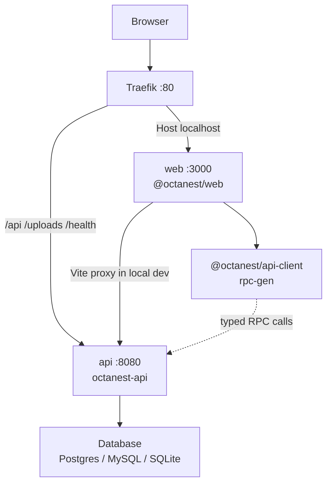

<!-- generated-by: gsd-doc-writer -->
# Architecture

## System overview

Octanest is a self-hostable GitHub-style social coding platform delivered as one product for cloud and on-prem. The system is a **layered monorepo**: a TanStack Start (Octane) web app talks to a Rust Axum API over a versioned JSON RPC (HTTP and WebSocket), which persists through a multi-dialect database adapter (`postgres` / `mysql` / `sqlite`). Docker Compose fronts the stack with Traefik so the browser hits a single origin (`Host(localhost)`), with path-based routing to web and API.

## Component diagram



Local development without Compose runs the API on `127.0.0.1:8080` and the Vite dev server on `:3000`, with proxies for `/api/*`, `/uploads`, and `/health` (see `apps/web/vite.config.ts`).

## Data flow

Typical authenticated request path:

1. **Entry** — Browser loads UI from Traefik → `web`, or Vite in local `make dev`. Session cookie `octanest_session` is same-origin.
2. **RPC call** — `@octanest/api-client` `createClient` POSTs to `/api/rpc` with `Octanest-RPC-Version: 1`, `credentials: "include"`, and body `{ procedure, input }`. WebSocket upgrades use `/api/rpc/ws` for the same procedure dispatch.
3. **Edge** — Traefik (priority 100) routes `/api`, `/uploads`, and `/health` to `api`; everything else under `Host(localhost)` goes to `web`.
4. **Axum** — `octanest-api` builds `RpcCtx`: resolves the opaque cookie via `SessionService` (SHA-256 of token looked up in DB), attaches the current `EmailSender`, then `rpc::dispatch` matches the procedure name.
5. **Domain + storage** — Handlers in `auth/`, `routes/`, etc. call `octanest_db::Database` (users, sessions, auth identities, auth settings). Dialect branching stays inside `octanest-db` only.
6. **Response** — `RpcResponse` JSON (`ok` + `data` or `error`). Auth mutations may attach `Set-Cookie` (set or clear). Avatar uploads use multipart `POST /api/user/avatar`; files are served from `/uploads/avatars/{file}`.

OAuth/OIDC browser flows leave the SPA for `/api/auth/workos/start|callback` and `/api/auth/oidc/start|callback`, then return with a session cookie.

## Key abstractions

| Abstraction | Role | Location |
| --- | --- | --- |
| `AppState` | Shared Axum state: DB, swappable email sender, sessions, pending auth, uploads dir | `crates/octanest-api/src/app.rs` |
| `RpcCtx` / `dispatch` | Session-aware RPC context and procedure router (`system.*`, `auth.*`, `user.*`, `admin.auth.*`) | `crates/octanest-api/src/rpc.rs` |
| `SessionService` | Opaque HttpOnly cookie; CSPRNG token in cookie, SHA-256 hash in DB; idle 24h / remember-me 30d | `crates/octanest-api/src/auth/session.rs` |
| `EmailSender` | Trait + adapters: log sink, SMTP (`OCTANEST_SMTP_URL`), Resend (`OCTANEST_RESEND_API_KEY`) | `crates/octanest-api/src/email/` |
| `Database` / `DbPool` / `Dialect` | Uniform DB façade over sqlx Postgres, MySQL, SQLite pools | `crates/octanest-db/src/{lib,pool,dialect}.rs` |
| `RpcRequest` / `RpcResponse` / `AppError` | Shared RPC envelope and error shape (Rust source of truth) | `crates/octanest-core/src/lib.rs` |
| Auth DTOs | `UserPublic`, provider modes, auth settings types shared with codegen | `crates/octanest-core/src/auth_types.rs` |
| `createClient` | Generated TS client + TanStack Query helpers; default `credentials: "include"` | `packages/api-client/src/index.ts` |
| `rpc-gen` binary | Emits `packages/api-client` from a maintained template (keep in sync with `rpc.rs`) | `crates/octanest-api/src/bin/rpc_gen.rs` |

### Auth sessions

- Cookie name: `octanest_session` (HttpOnly; `Secure` except `OCTANEST_ENV=development`/`dev`).
- Server store in dialect-specific `sessions` tables via `octanest-db`; never store the raw token.
- Procedures: `auth.signup`, `auth.login`, `auth.logout`, `auth.logout_all`, `auth.me`, `auth.provider_config`.
- Provider mode from instance settings: `local` | `workos` | `oidc` (`admin.auth.*` for admins).
- Empty-instance bootstrap (same path for cloud and self-host — no deployment-mode fork):
  - When both `OCTANEST_ADMIN_EMAIL` and `OCTANEST_ADMIN_PASSWORD` are set and `users` is empty, `main` seeds a `sys-admin` with username `system-administrator`, applies `OCTANEST_ALLOW_SIGNUP` (default false) to instance `allow_signup`, and marks `must_change_credentials` until `/setup/credentials` (`auth.confirm_admin_credentials`). Seed error → fail boot (exit 1).
  - When either/both admin ENV vars are unset and `users` is empty, `auth.bootstrap_status.needs_setup` is true; SSR/UI gates to `/setup`. While `needs_setup`, RPC allowlists only bootstrap/health procedures. `auth.bootstrap_setup` creates the first `sys-admin` + session and persists wizard `allow_signup`.
  - After bootstrap, `allow_signup` governs local signup (`auth.signup`, `/signup`, chrome CTAs); Admin → Auth can toggle it.

### Email adapters

Provider selection comes from DB auth settings (`email_provider`: `log` | `smtp` | `resend`); secrets stay in environment. Missing SMTP/Resend config falls back to the log sink. `admin.auth.update_settings` can rebuild the process-wide sender slot without restart.

### RPC codegen

```bash
make rpc-gen   # cargo run -p octanest-api --bin rpc-gen
make rpc-sync-check
```

Rust types and procedure names in `octanest-core` / `rpc.rs` are authoritative. `rpc-gen` writes typed `createClient` and Query helpers into `packages/api-client`. CI should fail on drift via `rpc-sync-check`. The web app imports `@octanest/api-client` through `apps/web/src/lib/api-client.ts`.

## Directory structure rationale

```
octanest/
├── apps/web/              # Octane TanStack Start UI (routes, chrome, auth screens)
├── packages/api-client/   # Generated TS RPC client (do not hand-edit src/index.ts)
├── crates/
│   ├── octanest-api/      # Axum HTTP/WS server, auth, email, rpc-gen
│   ├── octanest-core/     # Shared domain / RPC types (no I/O)
│   └── octanest-db/       # Multi-dialect sqlx adapter + migrations/
├── deploy/traefik/        # Optional Traefik static extras (Compose uses labels)
├── docs/                  # Operator docs (database, local auth stubs, architecture)
├── brand/                 # Product mark and brand assets
├── scripts/               # Smoke / tooling helpers used by Makefile
├── var/                   # Runtime state (uploads, SQLite file; gitignored)
├── docker-compose.yml     # Default: Traefik + web + api + postgres
├── docker-compose.*.yml   # MySQL / SQLite / dev-auth overlays
├── Makefile               # dev, rpc-gen, compose, migrate, smoke, e2e
├── Cargo.toml             # Rust workspace
└── package.json           # Bun workspaces: apps/*, packages/* + Turborepo
```

- **Split JS/Rust workspaces** — UI and generated client stay in Bun/Turbo; API and persistence stay in Cargo so dialect and auth logic remain typed and testable in Rust.
- **`octanest-db` as the only dialect boundary** — Callers use `Database` methods; migrations live under `migrations/{postgres,mysql,sqlite}/`.
- **Same-origin Traefik** — Avoids cross-origin cookie issues in Compose; local Vite proxies mirror that path layout.
- **`deploy/`** — Holds operator Traefik notes; primary routing is Compose labels on `web` and `api` (see root `docker-compose.yml`).
