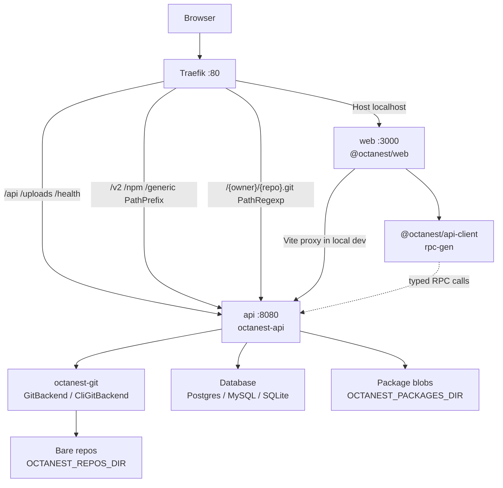

<!-- generated-by: gsd-doc-writer -->
# Architecture

## System overview

Octanest is a self-hostable GitHub-style social coding platform delivered as one product for cloud and on-prem. The system is a **layered monorepo**: a TanStack Start (Octane) web app talks to a Rust Axum API over a versioned JSON RPC (HTTP and WebSocket), which persists through a multi-dialect database adapter (`postgres` / `mysql` / `sqlite`). **Local Compose** fronts the stack with Traefik (Docker provider) so the browser hits a single origin (`Host(localhost)`), with path-based routing to web and API. **Octanest Cloud** uses the same api/web images behind a **file-configured Caddy** gateway (`deploy/cloud/`) — no Docker socket on the host (D-CLOUD-03).

## Component diagram



Local development without Compose runs the API on `127.0.0.1:8080` and the Vite dev server on `:3000`, with proxies for `/api/*`, `/uploads`, `/health`, and package prefixes `/v2`, `/npm`, `/generic` (see `apps/web/vite.config.ts`). Smart HTTP on `/{owner}/{repo}.git` is served by the API directly in local `make` workflows (no Traefik PathRegexp required).

## Data flow

Typical authenticated request path:

1. **Entry** — Browser loads UI from Traefik → `web`, or Vite in local `make dev`. Session cookie `octanest_session` is same-origin.
2. **RPC call** — `@octanest/api-client` `createClient` POSTs to `/api/rpc` with `Octanest-RPC-Version: 1`, `credentials: "include"`, and body `{ procedure, input }`. WebSocket upgrades use `/api/rpc/ws` for the same procedure dispatch.
3. **Edge** — Traefik (priority **110+**) routes `/v2`, `/npm`, `/generic` PathPrefix and `/{owner}/{repo}.git` PathRegexp to `api`; priority **100** routes `/api`, `/uploads`, and `/health` to `api`; everything else under `Host(localhost)` goes to `web`. On Octanest Cloud the same path priorities are expressed in `deploy/cloud/Caddyfile` (public Host catch-all; TLS at the platform edge).
4. **Axum** — For RPC, `octanest-api` builds `RpcCtx`: resolves the opaque cookie via `SessionService` (SHA-256 of token looked up in DB), attaches the current `EmailSender`, then `rpc::dispatch` matches the procedure name. Smart HTTP uses a separate route stack (Basic + PAT) — see [Git Smart HTTP & PATs](#git-smart-http--pats). Package registry mounts (`/v2`, `/npm`, `/generic`) use PAT∩ACL (cookies ignored) and content-addressed blobs under `OCTANEST_PACKAGES_DIR`.
5. **Domain + storage** — Handlers in `auth/`, `repo/`, `pat/`, `packages/`, `routes/`, etc. call `octanest_db::Database` (users, sessions, repositories, PATs, packages, auth settings). Dialect branching stays inside `octanest-db` only. Forge browse/create ops go through `octanest_git::GitBackend`; Smart HTTP wire protocol goes through `git-http-backend` CGI.
6. **Response** — `RpcResponse` JSON (`ok` + `data` or `error`). Auth mutations may attach `Set-Cookie` (set or clear). Avatar uploads use multipart `POST /api/user/avatar`; files are served from `/uploads/avatars/{file}`. Raw blobs and source archives use dedicated HTTP GETs under `/api/repos/...` (see [Git forge](#git-forge-gitbackend)). Git clients speak Smart HTTP under `/{owner}/{repo}.git/...`. Registry clients speak OCI/npm/generic under their path prefixes.

OAuth/OIDC browser flows leave the SPA for `/api/auth/workos/start|callback` and `/api/auth/oidc/start|callback`, then return with a session cookie.

## Key abstractions

| Abstraction | Role | Location |
| --- | --- | --- |
| `AppState` | Shared Axum state: DB, swappable email sender, sessions, pending auth, uploads dir, `GitBackend`, repos dir | `crates/octanest-api/src/app.rs` |
| `RpcCtx` / `dispatch` | Session-aware RPC context and procedure router (`system.*`, `auth.*`, `user.*`, `org.*`, `repo.*`, `pat.*`, `admin.*`) | `crates/octanest-api/src/rpc.rs` |
| `SessionService` | Opaque HttpOnly cookie; CSPRNG token in cookie, SHA-256 hash in DB; idle 24h / remember-me 30d | `crates/octanest-api/src/auth/session.rs` |
| `EmailSender` | Trait + adapters: log sink, SMTP (`OCTANEST_SMTP_URL`), Resend (`OCTANEST_RESEND_API_KEY`) | `crates/octanest-api/src/email/` |
| `GitBackend` | Trait seam for all forge git ops (init, tree, blob, refs, history, branch, archive, gc) | `crates/octanest-git/src/backend.rs` |
| `CliGitBackend` | Shipped Phase 7 adapter: system `git` CLI ≥ 2.5 via argv arrays (never `sh -c`) | `crates/octanest-git/src/cli.rs` |
| `Database` / `DbPool` / `Dialect` | Uniform DB façade over sqlx Postgres, MySQL, SQLite pools | `crates/octanest-db/src/{lib,pool,dialect}.rs` |
| `RpcRequest` / `RpcResponse` / `AppError` | Shared RPC envelope and error shape (Rust source of truth) | `crates/octanest-core/src/lib.rs` |
| Auth DTOs | `UserPublic`, provider modes, auth settings types shared with codegen | `crates/octanest-core/src/auth_types.rs` |
| `createClient` | Generated TS client + TanStack Query helpers; default `credentials: "include"` | `packages/api-client/src/index.ts` |
| `rpc-gen` binary | Emits `packages/api-client` from a maintained template (keep in sync with `rpc.rs`) | `crates/octanest-api/src/bin/rpc_gen.rs` |

### Git forge (`GitBackend`)

Phase 7 ships a self-hosted forge browse/create surface behind a deep **`GitBackend`** module in `octanest-git` (**GIT-09**, **GIT-10**, **D-32**):

| Concern | Contract |
| --- | --- |
| **Current adapter** | **`CliGitBackend`** — invokes the system `git` binary (≥ **2.5.0**). API **fails boot** if `git` is missing or below that floor (see [CONFIGURATION.md](CONFIGURATION.md)). |
| **Future adapter** | **`GixGitBackend`** (gitoxide) is **documented, not shipped**. Implement the same `GitBackend` trait when create / browse / branch / archive / gc coverage reaches parity. Do **not** call `gix` from API handlers or treat gitoxide as the Phase 7 primary backend. |
| **On-disk layout** | Bare repos at `{OCTANEST_REPOS_DIR}/{owner}/{name}.git` (default root `var/repos`). |
| **Owners** | Polymorphic `repositories.owner_type` (`user` \| `org`) + `owner_id`. Path `/{owner}/{repo}` resolves **user slug then org slug** in a shared namespace (same reserved-username rules). |
| **Capability ACL** | Central evaluator in `crates/octanest-api/src/repo/acl.rs` returns effective `Capability` (`Read` \| `Write` \| `Admin`). Highest-wins coalesce: personal owner / org Owner|Admin, org `member_base_permission` for Members, per-repo collaborator grants, public→Read. Collaborator is **per-repo only** — never an org membership role. |
| **Anti-enumeration** | Missing repos and unauthorized private **web/RPC** reads return identical `repo.not_found`. Smart HTTP maps private denials to **401 Basic** (not soft 404). |
| **RPC vs HTTP** | Metadata and mutations use JSON RPC (`repo.create`, `repo.tree`, `repo.blob`, `repo.commits`, branch/settings, collaborators, …). Large binary payloads use HTTP GET: `/api/repos/{owner}/{repo}/raw/{ref}/…` and `/api/repos/{owner}/{repo}/archive/{ref}.zip` / `.tar.gz` — same ACL resolve as RPC. |

API handlers depend on `Arc<dyn GitBackend>` (or the concrete `CliGitBackend` held on `AppState`), so swapping adapters later is a crate-local change, not a rewrite of `repo/*` routes.

### Organizations & permissions

Phase 10 ships orgs + ACL (ORG-01…04) on migration `0010_orgs_acl`:

| Concern | Contract |
| --- | --- |
| **Tables** | `organizations`, `organization_members` (Owner/Admin/Member), `organization_invites` (token hash at rest), `repository_collaborators`. |
| **Roles** | Org Owner/Admin manage membership (only Owner grants/changes Owner). Members inherit org `member_base_permission` (`none` \| `read` \| `write`) on org-owned private repos. |
| **Invites** | Email magic links via existing `EmailSender` + `OCTANEST_PUBLIC_ORIGIN`. Accepting a valid invite can create a verified local user **even when `allow_signup` is closed**. Existing invite-email accounts must sign in (`org.invite_login_required`) — no password steal on accept. |
| **Lookup** | `user.lookup` username autocomplete (no emails); rate-limited per session. |
| **Factory reset** | `factory_reset_instance` deletes repositories (cascades collaborators / PAT-repo links / **issue domain**) and organizations (cascades members / invites / org-scoped labels) before wiping auth users. |

### Issues & labels

Phase 11 ships issues + labels (ISS-01…04) on migration `0011_issues`:

| Concern | Contract |
| --- | --- |
| **Tables** | `issues`, `issue_counters`, `issue_comments`, `issue_revisions`, `comment_revisions`, `labels`, `repo_hidden_labels`, `issue_labels`, `issue_assignees`, `issue_reactions`, `comment_reactions`, `issue_links`. FK `ON DELETE CASCADE` from repositories / issues / orgs. |
| **Numbering** | Per-repo monotonic `#N` (`issue_counters.max_number`); hard-delete never reclaims. |
| **ACL** | Same Capability model as forge browse: Read+ view; Write+ mutate; Admin for label defs / hard-delete. Private soft not-found. |
| **UI** | Repo **Issues** tab (`/$owner/$repo/issues`); Write\|Preview markdown with `#N` autolink; Linked PRs panel prefers real `pr` links to `/pull/{n}` (legacy `pr_stub` kept). |
| **Deferred** | Closing keywords implemented on `pull.merge` into default branch (Phase 12 / D-PR-22). |

### Pull requests

Phase 12 ships pull requests (PR-01…07) on migration `0016_pull_requests`:

| Concern | Contract |
| --- | --- |
| **Tables** | `pull_requests`, `pull_comments`, `pull_reviews`, `pull_review_requests`, `pull_labels`, `pull_assignees`; repo columns `allow_merge_*` + `forked_from_repo_id`. Shared `#N` via `issue_counters`. CASCADE from repositories. |
| **Git** | `GitBackend` merge_commit / squash_merge / rebase_merge / fetch_ref_from / clone_bare (fork). |
| **RPC** | `pull.*`, `repo.fork`, `repo.mergeSettings.*` — see [API.md](API.md). |
| **UI** | Repo **Pulls** tab; `/pulls`, `/pulls/new`, `/pull/{n}` with Conversation / Commits / Files; merge panel; settings strategy toggles. |

### Social & Explore

Phase 21 adds stars, public profiles, explore, and fork-network metadata (SOC-01…04) on migration `0020_social` (extends Phase 12 `forked_from_repo_id`):

| Concern | Contract |
| --- | --- |
| **Tables** | `repository_stars`; repo columns `star_count`, `fork_network_id` (roots: `fork_network_id = id`). |
| **Stars** | `repo.star` / `repo.unstar` idempotent; `RepoPublic.star_count` + `viewer_has_starred`; `user.listStarred`. |
| **Profiles** | `user.getPublicProfile` (no email); `/{username}` vs org overview on `$owner.index`. |
| **Explore** | `repo.explore` + `/explore` (public only; sort stars then updated). |
| **Forks** | Extends `repo.fork` + `clone_bare`; `fork_network_id` for PR heads. Helper `repo::head_valid_for_base` (same repo **or** `head.fork_network_id == base.id`) — Phase 12 D-PR-01…03. |
| **UI** | Star/Fork on `RepoChrome`; `/explore`; `/$owner/$repo/fork` confirm. |

RPC: `issue.*` / `label.*` — see [API.md](API.md#issues-issue--labels-label).
RPC: `pull.*` — see [API.md](API.md).
RPC: social — see [API.md](API.md) procedure table (`repo.star`, `repo.explore`, `user.getPublicProfile`, `repo.fork`).

### Git Smart HTTP & PATs

Phase 8 adds HTTPS git clone/fetch/push beside the forge browse surface; Phase 10 intersects PAT auth with Capability ACL:

| Concern | Contract |
| --- | --- |
| **Wire protocol** | Axum mounts `info/refs`, `git-upload-pack`, `git-receive-pack` under `/{owner}/{repo}.git` and spawns **`git-http-backend`** CGI (`GIT_PROJECT_ROOT` = `OCTANEST_REPOS_DIR`). |
| **Auth split (D-01 / D-12)** | **Session cookies never authenticate git.** Smart HTTP uses HTTP Basic with password = PAT. Typed RPC (`/api/rpc`) stays on `octanest_session` only — do **not** send `Authorization: Bearer <pat>`. |
| **Hash-at-rest** | PAT plaintext is shown **once** at mint; DB stores SHA-256 of the secret (same pattern as sessions). Revoke soft-deletes; list never returns secrets. |
| **Prefixes** | Classic `octanest_pat_…`, fine-grained `octanest_fg_…` (CSPRNG hex after the prefix). Redacted docs examples only (`octanest_pat_REDACTED`). |
| **Classic scopes** | Scope catalog includes `repo` (HTTPS fetch + push where **PAT subject ∩ Capability ACL** allows — not `owner_id` equality alone). |
| **Fine-grained** | `selected` binds repository ids; `all` covers personal-owned plus org Owner/Admin repos. Collaborators use `selected`. Insufficient scope → HTTP 403; ACL denials stay 401 Basic. |
| **Clone URL** | `https://{OCTANEST_PUBLIC_ORIGIN host}/{owner}/{repo}.git` (D-18 / D-19). |
| **Edge** | Compose Traefik `PathRegexp` for `.git` → API (priority 110). See [CONFIGURATION.md](CONFIGURATION.md#git-smart-http--personal-access-tokens). |

RPC lifecycle: `pat.createClassic`, `pat.createFineGrained`, `pat.list`, `pat.revoke` (session + verified email for mint). Full path/auth/error matrix: [API.md](API.md).

### Git over SSH

Phase 9 adds SSH clone/fetch/push beside Smart HTTP:

| Concern | Contract |
| --- | --- |
| **Process** | In-process **`russh`** listener in `octanest-api` (`crates/octanest-api/src/ssh/`), gated by `OCTANEST_SSH_ENABLED`. Shares DB + `OCTANEST_REPOS_DIR` with Smart HTTP. |
| **Pack** | Allowlist `git-upload-pack` / `git-receive-pack` only; spawn system `git` with argv (no shell). ACL reuses Smart HTTP owner / visibility / verified-email rules; denials via **git stderr** (not HTTP codes). |
| **Auth** | Force SSH username **`git`**. Identity = registered public-key fingerprint (`ssh_public_keys`). Keys map to **full account** — no PAT scopes. |
| **Clone URL** | scp-style `git@{OCTANEST_SSH_HOST}:{owner}/{repo}.git` (D-SSH-02). Port advertised separately; `~/.ssh/config` when ≠ 22. |
| **Edge** | Compose **TCP `2222:2222`** on the API service — **not** Traefik. Host keys under `OCTANEST_SSH_HOST_KEY_DIR` (volume). |
| **Rate limit** | Failed pubkey auth: IP + fingerprint buckets (reuse PAT limiter pattern). |

RPC: `sshKey.add` / `list` / `revoke` (session + verified email for add). Smoke: `make smoke-git-ssh`. See [CONFIGURATION.md](CONFIGURATION.md#git-over-ssh).

### Git LFS

Phase 14 adds volume-backed Git LFS beside Smart HTTP:

| Concern | Contract |
| --- | --- |
| **Storage (D-LFS-01/02/03)** | Instance `OCTANEST_LFS_DIR` with OID shards `{ab}/{cd}/{oid}` + DB refcounts (dedup across repos). |
| **Wire (D-LFS-06/07)** | Batch + basic transfer under `/{owner}/{repo}.git/info/lfs/…` (streaming PUT, optional verify, Range GET). No multipart adapter. |
| **Auth (D-LFS-09)** | PAT Basic only — same as Smart HTTP; cookies ignored. Read download / Write upload. |
| **Enable (D-LFS-10)** | Per-repo flag; **Admin** only. |
| **Quotas (D-LFS-12/13/14)** | Env defaults + Admin overrides; reject oversize / over-quota uploads. |
| **GC / reset (D-LFS-15/04)** | Periodic unreferenced OID GC; factory reset `database_and_repositories` wipes LFS_DIR children. |
| **Edge** | Existing Traefik `.git` PathRegexp covers `info/lfs` — no extra router. |
| **SSH** | LFS-over-SSH deferred; SSH git remotes still use HTTPS LFS + credential helper. |

Operator knobs: [CONFIGURATION.md](CONFIGURATION.md#git-lfs). Client paths: [API.md](API.md#git-lfs).

### Auth sessions

- Cookie name: `octanest_session` (HttpOnly; `Secure` except `OCTANEST_ENV=development`/`dev`).
- Server store in dialect-specific `sessions` tables via `octanest-db`; never store the raw token.
- Procedures: `auth.signup`, `auth.login`, `auth.logout`, `auth.logout_all`, `auth.me`, `auth.provider_config`.
- Provider mode from instance settings: `local` | `workos` | `oidc` (`admin.auth.*` for admins).
- Empty-instance bootstrap (same path for cloud and self-host — no deployment-mode fork):
  - When both `OCTANEST_ADMIN_EMAIL` and `OCTANEST_ADMIN_PASSWORD` are set and `users` is empty, `main` seeds a `sys-admin` with username `system-administrator`, applies `OCTANEST_ALLOW_SIGNUP` (default false) to instance `allow_signup`, and marks `must_change_credentials` until `/setup/credentials` (`auth.confirm_admin_credentials`). Seed error → fail boot (exit 1).
  - When either/both admin ENV vars are unset and `users` is empty, `auth.bootstrap_status.needs_setup` is true; SSR/UI gates to `/setup`. While `needs_setup`, RPC allowlists only bootstrap/health procedures. `auth.bootstrap_setup` creates the first `sys-admin` + session and persists wizard `allow_signup`.
  - After bootstrap, `allow_signup` governs local signup (`auth.signup`, `/signup`, chrome CTAs); Admin → Auth can toggle it.
- Cookie sessions do **not** authorize Smart HTTP (D-12); mint/list/revoke PATs over RPC still require the session cookie.

### Email adapters

Provider selection comes from DB auth settings (`email_provider`: `log` | `smtp` | `resend`); secrets stay in environment. Missing SMTP/Resend config falls back to the log sink. `admin.auth.update_settings` can rebuild the process-wide sender slot without restart.

### RPC codegen

```bash
make rpc-gen   # cargo run -p octanest-api --bin rpc-gen
make rpc-sync-check
```

Rust types and procedure names in `octanest-core` / `rpc.rs` are authoritative. `rpc-gen` writes typed `createClient` and Query helpers into `packages/api-client`. CI should fail on drift via `rpc-sync-check`. The web app imports `@octanest/api-client` through `apps/web/src/lib/api-client.ts`.

## Directory structure rationale

```
octanest/
├── apps/web/              # Octane TanStack Start UI (routes, chrome, auth screens)
├── packages/api-client/   # Generated TS RPC client (do not hand-edit src/index.ts)
├── crates/
│   ├── octanest-api/      # Axum HTTP/WS server, auth, repo RPC/HTTP, email, rpc-gen
│   ├── octanest-core/     # Shared domain / RPC types (no I/O)
│   ├── octanest-db/       # Multi-dialect sqlx adapter + migrations/
│   └── octanest-git/      # GitBackend trait + CliGitBackend (system git)
├── deploy/
│   ├── traefik/           # Optional Traefik static extras (Compose uses labels)
│   └── cloud/             # Caddy file gateway for Railway-class cloud (no Docker socket)
├── .railway/              # TypeScript IaC (`railway.ts`) for Octanest Cloud — plan/apply operator-only
├── docs/                  # Operator docs (database, local auth stubs, architecture)
├── brand/                 # Product mark and brand assets
├── scripts/               # Smoke / tooling helpers used by Makefile
├── var/                   # Runtime state (uploads, SQLite file; gitignored)
├── docker-compose.yml     # Default: Traefik + web + api + postgres
├── docker-compose.*.yml   # MySQL / SQLite / dev-auth overlays
├── Makefile               # dev, rpc-gen, compose, migrate, smoke, cloud-plan, e2e
├── Cargo.toml             # Rust workspace
└── package.json           # Bun workspaces: apps/*, packages/* + Turborepo
```

- **Split JS/Rust workspaces** — UI and generated client stay in Bun/Turbo; API and persistence stay in Cargo so dialect and auth logic remain typed and testable in Rust.
- **`octanest-db` as the only dialect boundary** — Callers use `Database` methods; migrations live under `migrations/{postgres,mysql,sqlite}/`.
- **`octanest-git` as the only git process boundary** — Callers use `GitBackend`; CLI argv construction and future gitoxide live in this crate only.
- **Same-origin Traefik (Compose)** — Avoids cross-origin cookie issues locally; Docker provider requires a socket — **Compose-only**.
- **Cloud gateway (`deploy/cloud`)** — File-configured Caddy mirrors Compose path priorities for Railway-class hosts; IaC in `.railway/railway.ts` (see [DEPLOYMENT.md](DEPLOYMENT.md)).
- **`deploy/`** — Traefik notes for Compose; cloud ingress under `deploy/cloud/`.
- **Stack presets** — Day-one `/new` templates are in-repo packs under `crates/octanest-api/assets/stack-presets/` (community PRs; no marketplace UI yet). See [guides/stack-presets.md](guides/stack-presets.md).
- **Repos volume** — Compose binds `./var/repos` for bare git objects and `./var/lfs` for Git LFS OIDs; cloud mounts `forge-data` at `/var`. Knobs in [CONFIGURATION.md](CONFIGURATION.md) (`OCTANEST_REPOS_DIR`, `OCTANEST_LFS_DIR`, orphan/gc/LFS intervals).


## Actions control plane (Phase 19)

Actions lives in `crates/octanest-api/src/actions/`:

| Module | Role |
|--------|------|
| `parse` / `workflow` | YAML workflow discovery under `.github/workflows` |
| `dispatch` / `events` | push + pull_request enqueue (queued jobs only) |
| `runner_proto` | `/api/actions/*` runner HTTP |
| `tokens` / `secrets` | Registration tokens; AES-GCM repo secrets |
| `statuses` | Commit status publish for Phase 13 |
| `rpc` / UI | Session RPC + Octane routes under `/$owner/$repo/actions` |

**Registered runners only:** jobs stay `queued` until a compatible runner `fetch_task`s them. Custom `runs-on` labels match declared runner labels (`label[:schema[:args]]`, D-ACT-09). Official runner: `octanest-runner` (Rust, `crates/octanest-runner`) speaking the `/api/actions/*` JSON protocol; image built from `docker/octanest-runner`. Compose profile `actions` — see [DEPLOYMENT.md](DEPLOYMENT.md). Operators bring compute; Octanest does not sell managed minutes (ACT-07 / D-ACT-10).

Commit status contexts for Phase 13 required checks: `{workflow_name} / {job_key}` (YAML job id), published on job state transitions and queryable via `repo.commitStatus.list` (D-ACT-15 / D-ACT-16).
